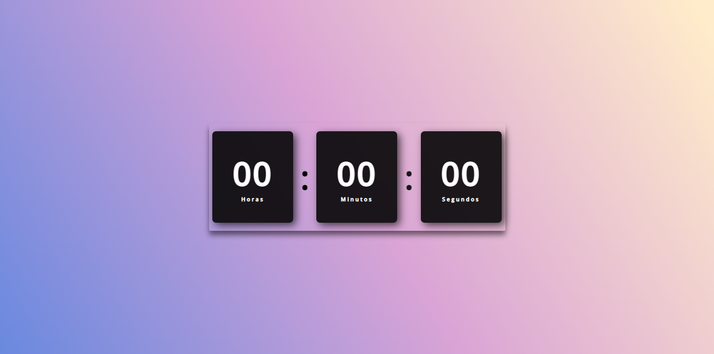

<h1 align="center"> Relógio Digital </h1>

Relogio Digital contruido com HTML, CSS e JavaScript 

  <a href="#-tecnologias">Tecnologias</a>&nbsp;&nbsp;&nbsp;|&nbsp;&nbsp;&nbsp;
  <a href="#-projeto">Projeto</a>&nbsp;&nbsp;&nbsp;|&nbsp;&nbsp;&nbsp;
  <a href="#memo-licença">Licença</a>

  

 

  

## 🚀 Tecnologias

Esse projeto foi desenvolvido com as seguintes tecnologias:

- HTML
- CSS
- JavaScript

## 💻 Projeto

Um relógio digital que funciona com base na data e hora do usuario.

- [Acesse o projeto finalizado, online](https://yoovitor.github.io/relogio-digital-js)

## :memo: Licença

Esse projeto está sob a licença MIT.